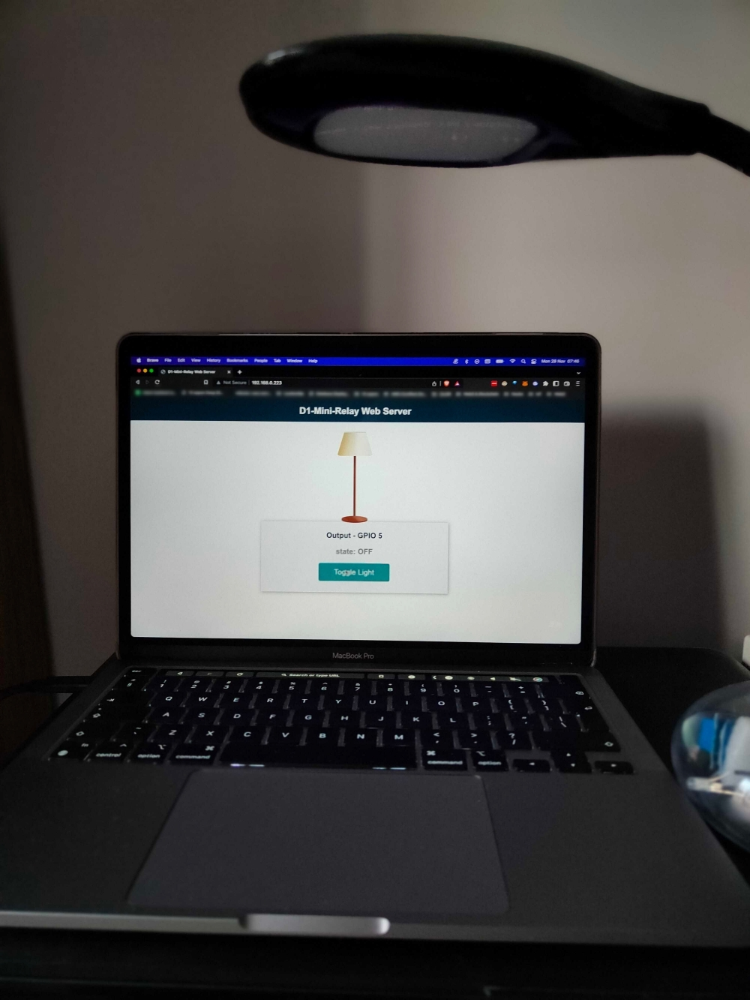
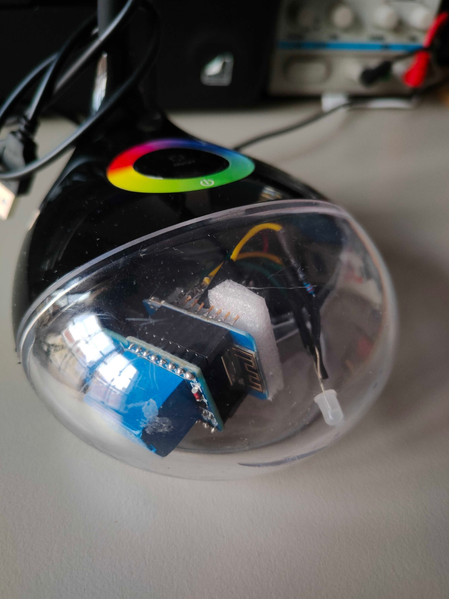
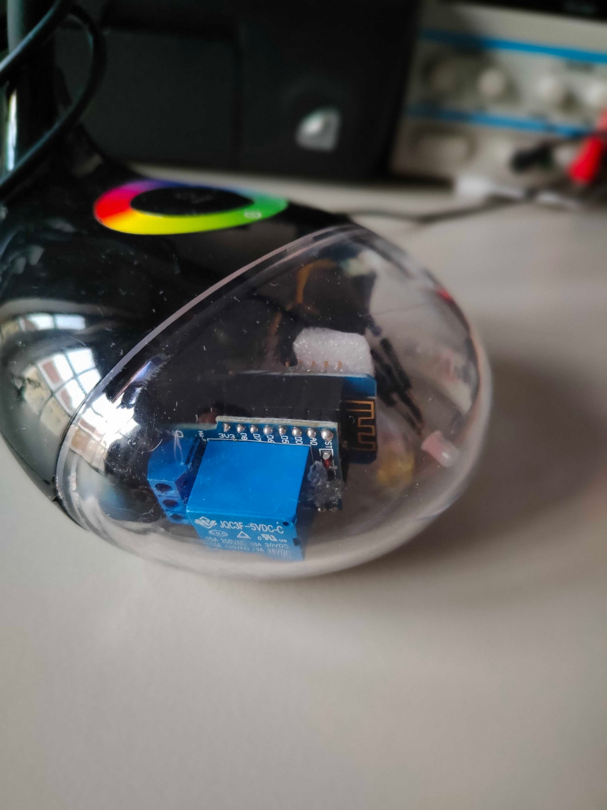

# ESP8266 D1 Mini Relay Lamp

Board: D1 Mini (ESP8266): [link to official board documentation](https://www.wemos.cc/en/latest/d1/d1_mini.html)
Relay shield: [link to official board documentation](https://www.wemos.cc/en/latest/d1_mini_shield/relay.html)

:information_source: D1 mini compatible board replacements work fine (tested)

## MQTT message payload

```
{
  "light_on": true,
  "red": 0,
  "green": 0,
  "blue": 0
}
```

```
{
  "message": "getConfig"
}
```

## Photo / Video Documentation








